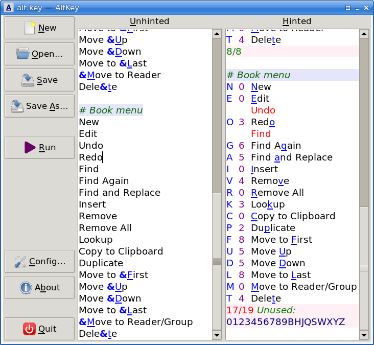

# AltKey

These applications are for calculating keyboard accelerators (e.g., for menu
options or dialog labels).

Both applications use the Kuhn-Munkres optimization algorithm with
weightings to prefer the first letter, or failing that, the first letter of
a word, or failing that, any letter. (Here “letter” means the Latin-1
letters A…Z and the digits 0…9.)

`altkey.tk` is a GUI application. Open `alt.key` as an example.

`altkey.tcl` is a command line tool. See `input.txt` for a test input file
and `expected.txt` to see the output.

Note: I use [Store](https://github.com/mark-summerfield/store) for version
control so github is only used to make the code public.

## Dependencies

Tcl/Tk >= 9.0.2; Tcllib; Tklib.

## License

GPL-3

---
